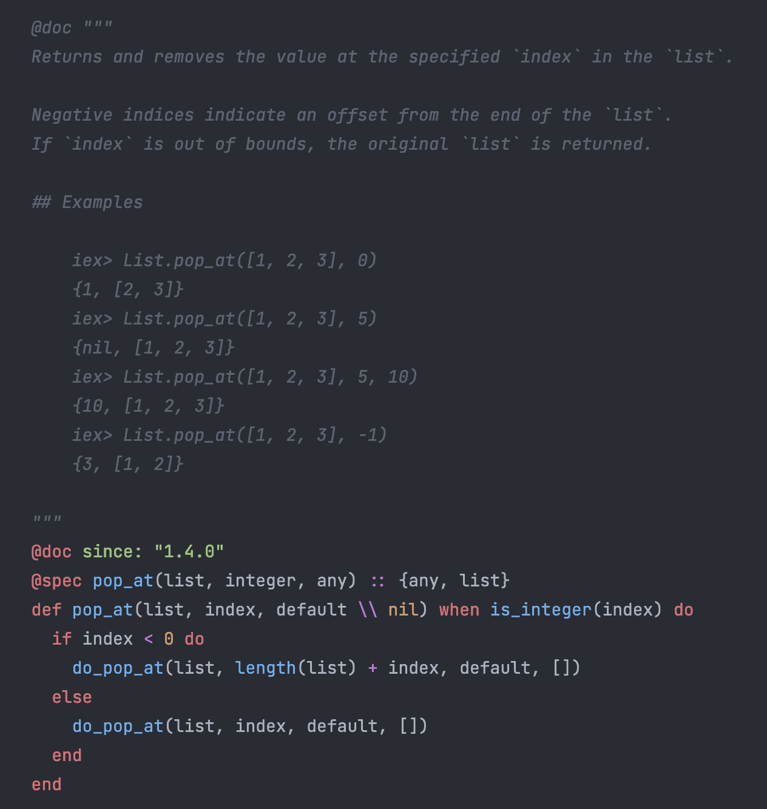
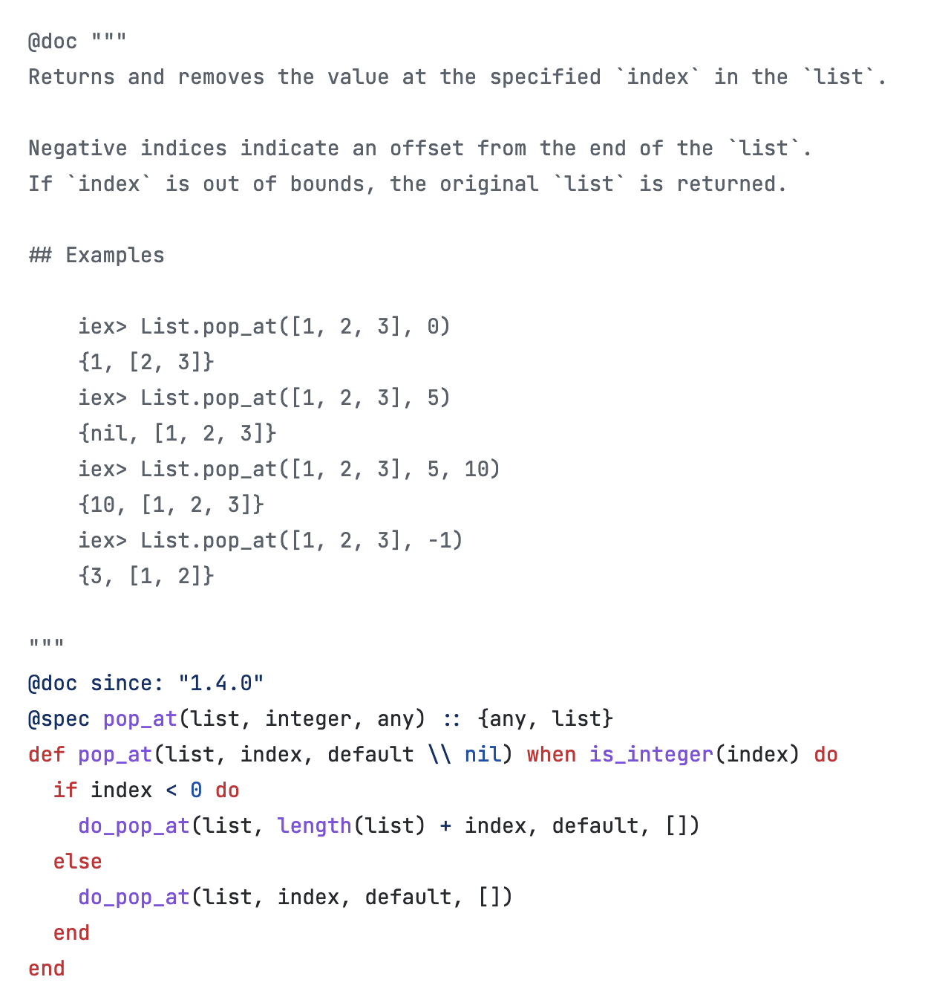

# Autumn

<!-- MDOC -->

<p align="center">
  
</p>

<p align="center">
  Syntax highlighter for source code parsed with Tree-Sitter and styled with Helix Editor themes.
</p>

<p align="center">
  <a href="https://hex.pm/packages/autumn">
    
  </a>

  <a href="https://hexdocs.pm/autumn">
    
  </a>

  <a href="https://opensource.org/licenses/MIT">
    
  </a>
</p>

## Features

Support [multiple languages](https://github.com/leandrocp/autumn/blob/main/native/inkjet_nif/Cargo.toml#L20) and [100+ themes](https://github.com/leandrocp/autumn/tree/main/priv/themes). See some samples at https://autumn-30n.pages.dev

Use Rust's [inkjet crate](https://crates.io/crates/inkjet) under the hood.

## Installation

Add `:autumn` dependency:

```elixir
def deps do
  [
    {:autumn, "~> 0.1"}
  ]
end
```

## Usage

```elixir
Autumn.highlight!("elixir", "Atom.to_string(:elixir)") |> IO.puts()
#=> <pre class="autumn highlight" style="background-color: #282C34; color: #ABB2BF;">
#=> <code class="language-elixir" translate="no">
#=> <span class="namespace" style="color: #61AFEF;">Atom</span><span class="operator" style="color: #C678DD;">.</span><span class="function" style="color: #61AFEF;">to_string</span><span class="" style="color: #ABB2BF;">(</span><span class="string" style="color: #98C379;">:elixir</span><span class="" style="color: #ABB2BF;">)</span>
#=> </code></pre>

Autumn.highlight!("rb", "Math.sqrt(9)", theme: "dracula") |> IO.puts()
#=> <pre class="autumn highlight" style="background-color: #282A36; color: #f8f8f2;">
#=> <code class="language-ruby" translate="no">
#=> <span class="constructor" style="color: #BD93F9;">Math</span><span class="punctuation delimiter" style="color: #f8f8f2;">.</span><span class="function method" style="color: #50fa7b;">sqrt</span><span class="punctuation bracket" style="color: #f8f8f2;">(</span><span class="constant numeric" style="color: #BD93F9;">9</span><span class="punctuation bracket" style="color: #f8f8f2;">)</span>
#=> </code></pre>
```

## Samples

Visit https://autumn-30n.pages.dev to see all [available samples](https://github.com/leandrocp/autumn/tree/main/priv/generated/samples) like the ones below:




## Looking for help with your Elixir project?


At DockYard we are [ready to help you build your next Elixir project](https://dockyard.com/phoenix-consulting).
We have a unique expertise in Elixir and Phoenix development that is unmatched and we love to [write about Elixir](https://dockyard.com/blog/categories/elixir).

Have a project in mind? [Get in touch](https://dockyard.com/contact/hire-us)!

## Acknowledgements

* [Logo](https://www.flaticon.com/free-icons/fall) created by by pongsakornRed - Flaticon
* [Logo font](https://fonts.google.com/specimen/Sacramento) designed by [Astigmatic](http://www.astigmatic.com)
